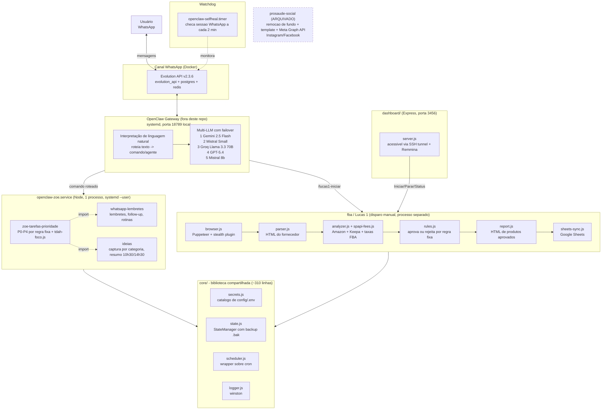

# OpenClaw Agents — Plataforma Multi-Agente via WhatsApp

> Sistema pessoal de automação que roda num servidor doméstico e se controla 100% por WhatsApp. Estrutura deste README: Visão → Arquitetura → Agentes → Stack → Operação → Estado Real & Limitações → Roadmap.

---

## 1. Visão do Projeto

### 1.1 Contexto

A maior parte das ferramentas de produtividade pessoal (lembretes, priorização de tarefas, pesquisa de produto) exige abrir um app, um painel ou um site. Este projeto inverte isso: o WhatsApp é a única interface. Toda automação — desde "lembra de pagar o boleto" até "esse produto do fornecedor vale a pena revender na Amazon" — acontece por mensagem, para uma assistente chamada **Zoe**.

O sistema roda 24/7 num servidor doméstico (`srv-desktop`), não em nuvem. Foi pensado, construído e mantido por uma única pessoa, com foco em resolver problemas reais do dia a dia (incluindo rotina com TDAH) antes de qualquer ambição de produto.

### 1.2 Problema que resolve

| Necessidade | Como o sistema resolve |
|---|---|
| Lembrar tarefas e compromissos sem abrir outro app | Comando de WhatsApp vira lembrete agendado (`whatsapp-lembretes`) |
| Priorizar o que fazer primeiro quando a lista trava | Categorização fixa P0–P4 + modo de foco para TDAH (`zoe-tarefas-prioridade`) |
| Não perder ideias que surgem fora de hora | Captura por categoria + resumo automático 2x por dia (`ideias`) |
| Decidir se vale a pena revender um produto de fornecedor na Amazon | Scraping + cálculo de lucro/margem/ROI automatizado (`fba`, codinome **Lucas 1**) |
| Manter a sessão do WhatsApp viva sem precisar olhar o servidor | Watchdog que verifica e reconecta a cada 2 minutos (`openclaw-selfheal`) |

### 1.3 Duas camadas, propositalmente separadas

| Camada | O que é | Onde mora |
|---|---|---|
| **OpenClaw Gateway** | Software à parte (não é código deste repositório) que entende linguagem natural do WhatsApp e roteia para o comando certo. Tem failover entre 5 modelos de LLM. | `/home/bonette/.openclaw/`, processo systemd próprio, porta `18789` (local) |
| **openclaw-agents** (este repositório) | Os agentes de negócio em si. **100% determinísticos** — regras fixas em JavaScript, sem chamada a LLM, sem RAG. | `/home/bonette/openclaw-agents/` |

Essa separação é intencional: a interpretação de linguagem natural (que pode "alucinar") fica isolada num componente; a lógica que decide "aprovar ou rejeitar este produto" ou "qual a prioridade desta tarefa" fica em código auditável e previsível.

---

## 2. Arquitetura

### 2.1 Diagrama

### 2.2 Por que essa divisão de componentes

- **Evolution API roda em Docker; o Gateway e a Zoe rodam nativos (systemd).** O canal de mensageria (mais genérico, mantido por terceiros) ganha isolamento de container; a lógica própria roda direto no host para simplificar debug e logs.
- **`zoe-tarefas-prioridade`, `whatsapp-lembretes` e `ideias` compartilham 1 processo Node**, não 3. Eram conceitualmente separados, mas rodar como import dentro do mesmo `openclaw-zoe.service` evita orquestrar múltiplos serviços para algo que troca poucas mensagens por minuto.
- **`fba` (Lucas 1) é deliberadamente manual e isolado.** Scraping com Puppeteer é pesado (precisa de display virtual, é mais frágil a mudanças no site da Amazon) — não faz sentido no mesmo processo crítico que recebe lembretes em tempo real.
- **`core/` é uma biblioteca utilitária, não um framework.** Só 4 módulos (secrets, state, scheduler, logger), ~310 linhas no total. Nenhuma camada de roteamento de IA mora aqui — isso é proposital, fica isolado no Gateway.

### 2.3 Hospedagem

| Item | Valor |
|---|---|
| Servidor | `srv-desktop`, doméstico, acesso via `ssh openclaw-server` |
| Usuário | `bonette` |
| Processos do projeto | `openclaw-zoe.service` (systemd `--user`, `Restart=always`) + `openclaw-selfheal.timer` (a cada 2 min) |
| Canal WhatsApp | Container Docker `evolution_api` (+ `evolution_postgres`, `evolution_redis`) |
| Painel visual do Lucas 1 | `dashboard/server.js` (Express, porta `3456`), acessado do notebook via túnel SSH (`./lucas1-dashboard-tunnel.sh`) |
| Visualização do navegador do Lucas 1 em tempo real | Remmina (`192.168.0.173:3390`) sobre display virtual (`DISPLAY`/`XAUTHORITY`) |
| Outros serviços no mesmo servidor (não relacionados) | Portainer, e os projetos `dopawise`, `qota-finance` — hospedados na mesma máquina, sem relação de código com este repositório |

---

## 3. Agentes

### 3.1 Tabela-resumo

| Agente | Arquivo principal | O que faz | Como é acionado | RAG? | LLM próprio? |
|---|---|---|---|---|---|
| `zoe-tarefas-prioridade` | `agents/zoe-tarefas-prioridade/index.js` | Prioriza tarefas em categorias fixas P0–P4; inclui modo de foco para TDAH (`tdah-foco.js`) | Comando WhatsApp (`/tdah-foco`, `/tdah-dopamina`, `/tdah-jogo`...) | Não | Não |
| `whatsapp-lembretes` | `agents/whatsapp-lembretes/index.js` | Lembretes, follow-ups e rotinas diárias. Absorveu o antigo agente `produtividade` (migração automática de estado na primeira execução) | Comando WhatsApp | Não | Não |
| `ideias` | `agents/ideias/index.js` | Captura ideias por categoria (Inovação, Conteúdo, Melhorias, Negócios, Aleatória); resume por WhatsApp 2x/dia | Cron interno (`10:30` e `14:30`, `core/scheduler.js`) | Não | Não |
| `fba` ("Lucas 1") | `agents/fba/index.js` | Lê HTML de fornecedor, cruza com Amazon/Keepa/taxas SP-API, aprova ou rejeita por regra de margem/ROI, gera relatório e sincroniza com Google Sheets | Manual (CLI, dashboard ou `/lucas1-iniciar` no WhatsApp) | Não | Não |
| `zoe-conhecimento` | `agents/zoe-conhecimento/index.js` | Responde perguntas em linguagem natural sobre o histórico do projeto (tarefas, produtos FBA, docs internos), citando fontes | Comando WhatsApp (`/zoe-sabe`, `/pergunta`) | **Sim** | **Sim** (Gemini, via LangChain.js) |

**Quatro dos cinco agentes são 100% determinísticos — sem RAG, sem LLM.** A exceção é `zoe-conhecimento` (seção 3.5), criado deliberadamente como agente isolado, em processo separado do `openclaw-zoe.service`, justamente para que a primeira chamada de LLM dentro deste repositório não contamine a lógica determinística dos outros quatro.

### 3.2 Modo de foco para TDAH

`tdah-foco.js` é um conjunto de comandos dedicados a sustentar foco e energia, dentro do agente `zoe-tarefas-prioridade`:

| Comando | Função |
|---|---|
| `/tdah-foco` | Inicia um bloco de foco guiado |
| `/tdah-dopamina` | Sugestão de microtarefa rápida para gerar momentum |
| `/tdah-jogo` | Gamificação de tarefas pendentes |

### 3.3 Agente arquivado — `prosaude-social`

Existiu como agente de publicação automática em redes sociais para a marca **Pro Saúde**:

1. Removia o fundo de imagens de produto (`rembg` local ou API Remove.bg)
2. Compunha a imagem num template fixo (`config/prosaude-templates/default.png`)
3. Publicava no Instagram e Facebook via **Meta Graph API** (`META_ACCESS_TOKEN`, `META_PAGE_ID`, `INSTAGRAM_ACCOUNT_ID`)

**Status atual: desativado.** O código-fonte foi removido; resta apenas o workspace arquivado (`archive/disabled-workspaces/`) com imagens de teste e a documentação da skill. Não há geração de imagem por IA generativa envolvida — era remoção de fundo + composição em template estático.

### 3.4 Ferramenta auxiliar standalone — `hubspot-upsert.js`

Script de linha de comando (`scripts/hubspot-upsert.js`) que cadastra ou atualiza **empresas** no CRM HubSpot via API REST (`api.hubapi.com/crm/v3/objects/companies`). Uso manual, não tem cron nem é chamado por nenhum agente. Provavelmente combinado com prospecção B2B (existe uma persona `moontech-prospecting` registrada no Gateway). **Não tem ligação no código com o agente de Instagram/Facebook** — são integrações independentes que coexistiram no mesmo projeto.

### 3.5 Agente com RAG — `zoe-conhecimento`

Único agente que quebra a regra "sem LLM, sem RAG" dos demais — de propósito, isolado. Responde perguntas em linguagem natural sobre o histórico real do projeto, citando fontes.

| Item | Detalhe |
|---|---|
| Comando | `/zoe-sabe <pergunta>` ou `/pergunta <pergunta>` |
| Corpus | `storage/state/fba.json`, `storage/state/zoe-tarefas-prioridade.json`, `storage/state/whatsapp-lembretes.json` (ou `.bak`), `storage/state/COMMANDS.md`, `docs/RUNBOOK.md`, `docs/Guia-Para-Open-Claw.md` |
| Vector store | Cosine similarity manual sobre JSON (`storage/state/zoe-conhecimento-index.json`, via `StateManager`) — sem dependência nativa de vetor (HNSWLib/Faiss), corpus pequeno o suficiente pra busca por força bruta |
| Embeddings | `text-embedding-004` (Google), via `@langchain/google-genai` |
| LLM de resposta | `gemini-2.5-flash` (Google), mesma família do provider primário do Gateway |
| Orquestração | LangChain.js — `RecursiveCharacterTextSplitter` (chunking) + `ChatPromptTemplate` (prompt RAG) |
| Isolamento | Processo separado, disparado via CLI (`scripts/zoe-conhecimento-command.js`) — não importado no `openclaw-zoe.service`, para que uma falha de API/alucinação não tenha qualquer chance de afetar os 4 agentes determinísticos |
| Indexação | Manual: `npm run conhecimento:ingest` (não agendada — reindexar é ação deliberada após atualizar docs/dados) |

Setup completo em [`agents/zoe-conhecimento/README.md`](agents/zoe-conhecimento/README.md). Requer chave própria (`GOOGLE_GENAI_API_KEY`, gratuita em [aistudio.google.com/apikey](https://aistudio.google.com/apikey)) — nenhum outro agente usa ou compartilha essa chave.

---

## 4. Stack e Decisões Técnicas

| Camada | Escolha | Por quê |
|---|---|---|
| Runtime | Node.js ≥ 22, ESM (`"type": "module"`) | Padrão atual do ecossistema; sem necessidade de transpilação |
| Scraping HTML | `cheerio` | Parsing leve de HTML estático (lista de fornecedor) |
| Automação de navegador | `puppeteer` + `puppeteer-extra` + `puppeteer-extra-plugin-stealth` | Necessário para Amazon/Keepa, que bloqueiam bots; o plugin stealth reduz detecção |
| Integração com planilhas | `googleapis` | Sincronização de produtos aprovados com Google Sheets |
| Logging | `winston` | Logs estruturados por agente, com rotação |
| Agendamento | `cron` | Wrapper fino em `core/scheduler.js`; timezone fixo `America/Sao_Paulo` |
| Servidor HTTP | `express` | Só para o dashboard do Lucas 1 |
| Config | `dotenv` | `.env` nunca commitado (confirmado: zero ocorrência no histórico do Git) |
| Canal WhatsApp | Evolution API v2.3.6 (Docker) | Implementação open-source madura do protocolo WhatsApp, evita reimplementar o cliente |
| Camada de IA conversacional | OpenClaw Gateway, multi-provider com failover (Gemini → Mistral → Groq → GPT → Mistral 8b) | Resiliência a indisponibilidade/custo de um provedor único; nenhum modelo Anthropic configurado hoje |
| Persistência de estado | JSON por agente em `storage/state/`, com backup `.bak` automático | Sem necessidade de banco de dados para o volume atual; simplicidade de backup (copiar arquivo) |
| Deploy | Scripts próprios (`scripts/deploy.sh`, `deploy-live.sh`) + systemd `--user` | Sem Kubernetes/Docker Swarm — overkill para um servidor doméstico único |

---

## 5. Estado Real e Limitações Conhecidas

Esta seção existe para que o README não infle o que o sistema faz. Em ordem de relevância:

1. **RAG existe hoje só em `zoe-conhecimento` (seção 3.5)**, agente isolado e recente. Os outros 4 agentes continuam sem RAG e sem chamada de LLM — decisão arquitetural mantida de propósito.
2. **A lógica de negócio dos 4 agentes determinísticos não chama LLM diretamente.** Priorização, aprovação de produto, etc. são regra fixa em JavaScript — previsível por design. "Inteligência artificial" vive na camada de interpretação de comando do Gateway e, agora, também em `zoe-conhecimento` — não na lógica dos outros agentes.
3. **`zoe-conhecimento` depende de uma chave de API externa (`GOOGLE_GENAI_API_KEY`).** Sem ela configurada, o comando `/zoe-sabe` simplesmente não funciona — é a única funcionalidade do repositório com essa dependência externa.
4. **Bug conhecido (ainda não corrigido):** existe uma unidade systemd a nível de sistema, `openclaw-produtividade.service`, tentando iniciar `agents/produtividade/index.js` — arquivo que não existe mais desde a fusão desse agente em `whatsapp-lembretes`. Resultado: crash-loop contínuo (sem impacto na Zoe, que roda como serviço de usuário separado e saudável). Correção: desabilitar essa unidade legada no servidor.
5. **Pastas vazias remanescentes:** `amazon-fba/` e `artes-prosaude/` na raiz não têm mais conteúdo — candidatas a limpeza.
6. **Clone local pode ficar desatualizado em relação ao servidor.** O diretório `/home/bonette/openclaw-agents` no servidor não é versionado como o repositório Git local — mudanças feitas direto no servidor podem não estar refletidas aqui até serem trazidas manualmente.

---

## 6. Roadmap / Considerações Futuras

- **Ampliar o corpus do `zoe-conhecimento`** para mais fontes (ex. histórico completo de `ideias`, relatórios do Lucas 1) conforme o uso real mostrar necessidade
- **Padronizar o provider de LLM do Gateway**, avaliando custo × qualidade entre os 5 atuais (e considerar Claude como opção)
- **Resolver o `openclaw-produtividade.service` fantasma** (item 4 da seção 5)
- **Reativar `prosaude-social`** com pipeline mais robusto, se houver decisão de negócio para isso
- **Versionar `/home/bonette/openclaw-agents` no servidor** como o mesmo Git deste repositório, eliminando a divergência servidor × GitHub
- **Métricas de uso**: quantos lembretes/tarefas processados por dia, taxa de produtos aprovados pelo Lucas 1

---

## Créditos e Contexto

Projeto pessoal, construído e operado por um único desenvolvedor, hospedado em servidor doméstico. Não há equipe, não há SLA formal — a "produção" aqui é o uso diário real do próprio autor.
